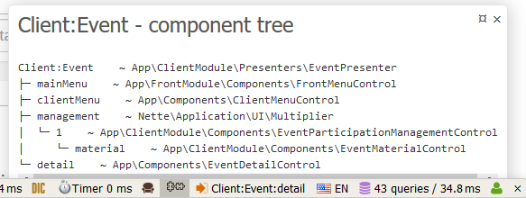

# Component model tree panel & dumper for Nette

A Tracy panel and general dumper for visualising components in the current component tree in Nette.
Displays components that get loaded during the page rendering.

Useful in cases where the component structure is more complex
or one simply wants to inspect if correct components get loaded.




## Usage

In config:
```
decorator:
	Nette\Application\Application:
		setup:
			- Dakujem\Nette\ComponentTreeDumper::registerPanel()
```

or in `index.php`:
```php
$container = require __DIR__ . '/../app/bootstrap.php';

$app = $container->getService( Nette\Application\Application::class );
Dakujem\Nette\ComponentTreeDumper::registerPanel( $app );
$app->run();
```

>
> Note:
>
> The panel only displays components that are loaded during the shutdown.
> Components unloded before shutdown are not displayed in the panel.
>
> One can, however, use the dumper to display the component tree by
> manually calling `ComponentTreeDumper::out` method at any time.
>


## Installation

`$` `composer require dakujem/component-tree-dump`


----

> For icon credits, please see `icons/credits.md`.
